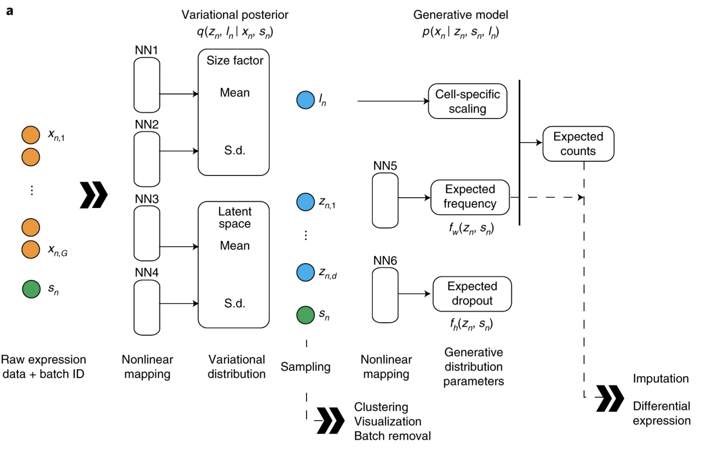
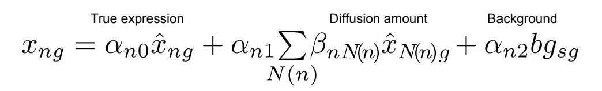
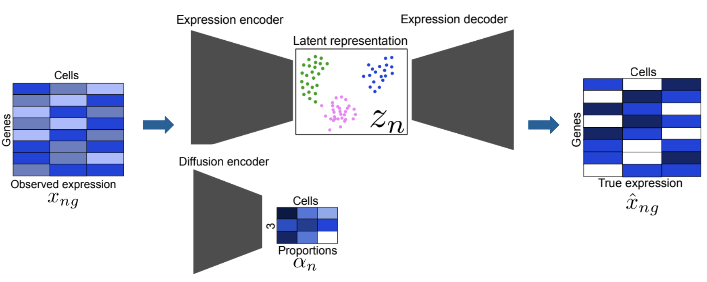

# scVI and ResolVI for Interpreting and Denoising Spatial Transcriptomics Data

## Introduction
Spatial transcriptomics (ST) has significantly furthered our ability to study cellular architecture and tissue environments by combining single-cell RNA sequencing with spatial locations of cells. However, ST methodologies are constrained by data-driven limitations, often due to the complexity of their datasets, which consist of thousands of genes measured in hundreds of thousands of spatially resolved cells/spots. The technical noise that accompanies these high-dimensional data sets, including ambient RNA contamination, background transcripts, bleedover expression, and over-dispersion, makes it difficult to extract true biological insights from our data analysis (Ergen & Yosef, 2025). 

To address these issues, computational approaches for generating biological insight from ST data must model not only gene expression and spatial data, but the underlying structure and biases that come along with it. Deep generative models have risen to prominence for their predictive power and ability to extract informative patterns from complex datasets, and they have become essential to modern computational biology. For all kinds of omics data, these models have the ability to represent latent biological variation while quantifying and accounting for different sources of technical noise. Amongst these models, scVI, from UC Berkeley’s Yosef Lab, has become a foundational model for analysis of single-cell omics data (Lopez et al., 2018).

However, scVI alone does not incorporate the spatial context that makes ST such a powerful tool for single-cell analysis. Since the release of scVI, an entire library of scVI-based models has been released under the scvi-tools framework, containing models for niche applications of single-cell omics methodologies, including ST (Gayoso et al., 2022). ResolVI, a deep generative model released in early 2025, builds upon scVI’s architecture and models ST data by differentiating observed RNA transcripts into three distinct categories: true cell, neighboring cells, and background (Ergen & Yosef, 2025). Through this approach, ResolVI provides denoised, spatially corrected gene expression counts that enable a more accurate understanding of tissue organization. 

Here, we explore how scVI and ResolVI together form a powerful workflow for ST analysis. We dive into the challenges of interpreting spatial data, the principles of deep generative modeling, and the complementary roles of scVI and ResolVI in enabling accurate, biologically meaningful interpretation of complex spatial datasets. 

## Background
ST technologies extend the power of scRNA sequencing by mapping gene expressions to coordinates in tissue samples. Methods like dissociative single-cell profiling require scientists to break apart tissue samples to extract expression data, which can lose valuable context. In the current bioinformatics space, a range of platforms now enable spatially resolved transcriptome profiling at various scales and resolutions, tailored to the research being conducted. For example, slide-based capture methods such as 10x Genomics Visium provide a holistic view of the tissue coverage along with spot-level resolution. Additionally, hybridization platforms like MERFISH and Xenium offer resolutions from spot-level to near-molecular. With such complex, diverse modalities, the purpose of these tools remains straightforward: to measure gene expression and spatial position simultaneously to model cellular architecture.

Like scRNA-seq, spatial count matrices are sparse and over-dispersed, which reflects both true biological heterogeneity and stochastic capture effects. Surrounding background RNA can also introduce contamination signals that artificially inflate the transcripts. Additionally, segmentation errors can cause mis-assigned transcripts to arise, which causes misaligned cell-type matches. Furthermore, current ST technologies like Visium often capture mixtures of cell types due to limited resolution. These limitations have demonstrated a dire need for software tools that can process data while accounting for noise: “Post‑hoc denoising methods…distort biological structure, underscoring the need for probabilistic models that explicitly characterize noise rather than smoothing it away” (Agarwal et al., 2020).

Unfortunately, standard data-processing pipelines are not equipped to resolve these issues. Even when using normalization schemes, like log-transformation, CPM scaling, or ad hoc filtering, they typically fail to model the underlying structure and often introduce biases that become amplified in downstream analysis. Moreover, spatial smoothing methods (kernel smoothing, KNN smoothing, etc.) simply assume that nearby spots should have similar expression profiles and make predictions accordingly. They fail to model where noise actually stems from and lack a probabilistic framework to quantify uncertainty. This is exactly deep probabilistic models like scVI excel.

## Foundations: Probabilistic Modeling and scVI
Deep generative models have become essential due to how they address the shortcomings of traditional computational methods. Standard methods treat data at face value and simply rely on mathematical transformations to process highly complex data. Deep generative models, on the other hand, are trained to learn trends that explain *how* data is generated. This means that they are able to model the noise within data and capture nonlinear biological structure and uncertainty. In this regard, the scvi-tools software ecosystem has proven itself as a flexible, scalable framework built for modeling single-cell and spatial omics by using probabilistic methods. To be more specific, scvi-tools provides a collection of models that share a mathematical foundation rooted in the original scVI software tool, allowing them to learn biological structure while also accounting for discrepancies in measurements across a variety of niche omics applications. The models within scvi-tools do not require ad-hoc normalization or heuristic smoothing like other workflows or downstream analysis methods. Most importantly, however, scvi-tools is designed to scale alongside the ever-growing size of single-cell datasets. As a result, it supports researchers in analyzing millions of cells without compromising task efficiency and precision.

At the center of the scvi-tools ecosystem, as the name implies, is scVI: a deep variational model that is customized to the characteristics of scRNA-seq count data. This model is built upon a variational autoencoder, which encodes each cell’s high-dimensional expression profile into a low-dimensional latent space. After compression, a decoder then reconstructs the data using a probability distribution that reflects the high variability in gene expression counts (Lopez et al., 2018). More specifically, scVI captures the inherent biological variability by modeling gene expression through a negative binomial distribution (Lopez et al., 2018). In addition, this tool filters out technical effects, including but not limited to batch differences, sequencing depth, and donor cell-specific noise. The resulting latent space after this process serves as a denoised representation of a cell's identity and can often reveal cellular structures that are not originally visible in the raw data.

Figure credit: (Lopez et al., 2018)

Considering scVI’s efficacy for modeling noise, it serves as a strong foundation for spatial models, as ST datasets are especially susceptible to noise, contamination, and sparsity, as previously described. The algorithms to generate latent embeddings help researchers take into account underlying biological patterns that would otherwise be masked. Furthermore, these embeddings support a wide range of downstream tasks that are critical for the spatial analysis workflow, like normalization, integration, and differential expression testing. 

However, scVI on its own serves as a robust foundation for interpreting ST data, not a solution. This is due to one glaring limitation – scVI does not take into account the spatial coordinates of cells, which is the backbone of spatial transcriptomics. To address this shortcoming, several spatial models have been built upon scVI and integrated into the scvi-tools ecosystem. DestVI performs cell-type deconvolution for Visium spots, gimVI imputes counts for missing genes between paired scRNA-seq and spatial datasets, and Tangram aligns single-cell expression with image-based spatial measurements. However, the newest of these models – ResolVI – stands out as the sole spatial model within this framework that explicitly denoises single-cell spatial data at the transcript-level. ResolVI models spatial noise within ST datasets directly, reallocating the observed transcripts into three distinct categories: background contamination, neighborhood leakage, and true expression. As the only tool that directly models different sources of spatial noise within its architecture, ResolVI is the most relevant model to discuss in the context of correcting for noise within complex spatial datasets. 

## ResolVI Architecture
ResolVI builds upon the probabilistic framework of scVI by introducing a more advanced generative model that accounts for spatial structure and transcript-level noise. Spatial data violates an inherent assumption made by scVI about single-cell omics data, which is that all observed counts originate from the cell being profiled. Leaks across segmentation boundaries between neighboring cells and background RNA transcripts introduce contamination in spatial assays that ResolVI aims to resolve. To accomplish this, ResolVI employs a mixture-based formulation to enable the model to separate true biological signals from spatial noise: 

Figure credit: (Ergen & Yosef, 2025)

ResolVI begins with the latent cell representation derived from scVI’s encoder – this captures the underlying biological state. The latent embedding is then integrated with spatial information captured by ST platforms, which includes distances between cells and cell boundaries defined by segmentation algorithms. These spatial features allow ResolVI to predict the contributions from each transcript compartment to the observed counts. More specifically, the underlying true expression is modeled through a negative binomial distribution, and the neighbor diffusion and background expression are modeled through a Poisson distribution, which is applied to a spatial decay function for computing neighbor diffusion and a gene-specific ambience profile for background expression (Ergen & Yosef, 2025). Informed by these priors, ResolVI uses variational inference to reconstruct the corrected expression matrix that reflects the most probable biological signal, producing a much clearer view of the sample’s true tissue organization.

The neural network architecture implements this framework through three modules: an expression encoder, a diffusion encoder, and a shared decoder. 
1. Expression Encoder: The expression encoder is the standard scVI-style encoder. It is a feed-forward neural network that encodes each cell’s high-dimensional gene expression vector into a low-dimensional latent variable according to an approximate posterior. This latent space represents each cell’s biological state.
2. Diffusion Encoder: The diffusion encoder is the independent spatial encoder that consists of several dense layers and nonlinear activation functions, and it encodes the mixture weights to learn how much of the observed expression is associated with each transcript compartment. The diffusion encoder also uses a feed-forward neural network and predicts a Dirichlet mixture over the three compartments to output a vector that represents each compartment's weight.
3. Expression Decoder: The expression decoder takes the latent variable produced by the expression encoder and uses it to reconstruct the final, denoised true expression vector for each cell. 

To then generate the final output, the model uses the mixture model highlighted earlier to predict true, corrected expression counts from the observed counts, diffusion amount, and background.

Figure credit: (Ergen & Yosef, 2025)

## Modern Applications
Today, deep generative models from the scvi-tools ecosystem are already embedded in real ST workflows. scVI in particular is now a backbone of many scRNA-seq pipelines (Lopez et al., 2018). For example, it is being used currently to decipher the tumor microenvironment, correct segmentation errors in dense tissue, and harmonize sparse spatial data with single-cell references, amongst a variety of other applications. First, in studying cancer samples, the boundary between tumor and immune cells is unclear. Dead tumor cells release RNA, which makes nearby T-cells look like they are expressing tumor markers. To address this issue, scVI can learn the distinct latent signature of a T-cell versus that of a tumor cell so that the model knows what should be there and what should not (Lopez et al., 2018). ResolVI, similarly, differentiates the signal that we are looking for from other background and neighboring signals on a more complete, spatially-informed level (Ergen & Yosef, 2025). This allows us to computationally process and clean the borders of tumors. As a result, this gives an insight into rare and transitional immune states that are driven by spatial organization and may have been previously hidden by noise.

Another application is the correction of segmentation errors in dense tissue. Because cells in the brain, specifically the cortex and hippocampus, are packed tightly together, segmentation algorithms, which attempt to draw borders around cell boundaries, are particularly susceptible to bleedover expression from neighboring cells. For example, an inhibitory neuron might look like it has excitatory markers due to diffusion from a neighbor. ResolVI addresses this problem through its mixture model, outputting the corrected expression profile, removing the need to re-segment the image (Ergen & Yosef, 2025). Overall, this creates cleaner cell-type atlases for practically any tissue environment.

Finally, spatial data often has missing genes and lower sensitivity when compared to standard single-cell sequencing, and scVI and ResolVI can be used to address this problem. scVI projects the spatial data into the same latent space as a high-quality scRNA-seq reference atlas (Lopez et al., 2018), and ResolVI handles the specific noise profile of the spatial platform so it better aligns with the clean single-cell data (Ergen & Yosef, 2025). As a result, gaps in the spatial data can be filled, and information from single-cell data can be used to annotate sparse spatial spots with a much higher accuracy and confidence.

## Future Directions
While ResolVI is effective at capturing spatially resolved gene expression data (Ergen & Yosef, 2025), its current design limits practical use in multi-omics contexts. Modern spatial platforms allow joint measurement of mRNA, protein, and chromatin. Because protein data have unique noise characteristics, next-generation tools must be able to generate multi-modal representations of tissue environments and their noise, incorporating RNA, protein, and chromatin profiles jointly (Gayoso et al., 2021).

Additionally, current approaches often model tissue as a “stack of 2D images,” failing to capture structure along the z-axis (Zeira et al., 2022). Volumetric reconstruction introduces bleedover between slices. While ResolVI handles lateral (x,y) diffusion (Ergen & Yosef, 2025), a 3D extension is needed to model signal bleedover along the z-axis, and scVI-based integration methods are needed to model the inherent variation between slices. Similarly, current models treat spatial data as static and fail to capture the dynamics within ever-changing tissue environments. This also requires much higher dimensionality within spatial data. Integrating RNA velocity into spatial models would allow prediction of future cell states within tissue architectures, enabling better analysis of phenomena like cancer invasion (Gayoso et al., 2024). 

Finally, applying these frameworks is computationally expensive. Although scvi-tools supports transfer learning, resolVI models are not cross-applicable between different tissue samples. Developing a ResolVI-like model that can be pre-trained on an expensive, diverse set of tissue/patient data would be a massive step, with high cost upfront, but much better efficiency for future use, enabling pathologists to better identify spatially-dependent tissues like tumors in real time.

## Conclusion
Together, scVI and ResolVI illustrate the applicability of deep learning-based frameworks in processing noisy, contaminated spatial transcriptomics data into interpretable, coordinate-specific counts that represent true biological variation. scVI provides a scalable encoder architecture that generates a latent space to capture underlying cell states, while ResolVI provides transcript-level, spatially informed denoising to correct for spatial noise. However, the limitations of these current approaches reveal the need for a new generation of spatial analysis tools – ones designed to make high-resolution spatial insights that are robust enough to make deeper insights into the complex, dynamic nature of tissue environments within research and clinical settings.

## Works Cited
1. Agarwal, D., Wang, J. & Zhang, N. R. Data denoising and post-denoising corrections in single cell RNA sequencing. *Statistical Science* **35**, 112–128 (2020). https://doi.org/10.1214/19-STS7560
2. Lopez, R., Regier, J., Cole, M. B. *et al.* Deep generative modeling for single-cell transcriptomics. *Nature Methods* **15**, 1053–1058 (2018). https://doi.org/10.1038/s41592-018-0229-2
3. Ergen, C. & Yosef, N. ResolVI – addressing noise and bias in spatial transcriptomics. *bioRxiv* (2025). https://doi.org/10.1101/2025.01.20.634005
4. Gayoso, A., Steier, Z., Lopez, R. *et al.* Joint probabilistic modeling of single-cell multi-omic data with totalVI. *Nature Methods* **18**, 272–282 (2021). https://doi.org/10.1038/s41592-020-01050-x
5. Zeira, R., Land, M., Strzalkowski, A. & Raphael, B. J. Alignment and integration of spatial transcriptomics data. *Nature Methods* **19**, 567–575 (2022). https://doi.org/10.1038/s41592-022-01459-6
6. Gayoso, A., Weiler, P., Lotfollahi, M. *et al.* Deep generative modeling of transcriptional dynamics for RNA velocity analysis in single cells. *Nature Methods* **21**, 50–59 (2024). https://doi.org/10.1038/s41592-023-01994-w
7. Gayoso, A., Lopez, R., Xing, G. et al. A Python library for probabilistic analysis of single-cell omics data. Nat Biotechnol 40, 163–166 (2022). https://doi.org/10.1038/s41587-021-01206-w
